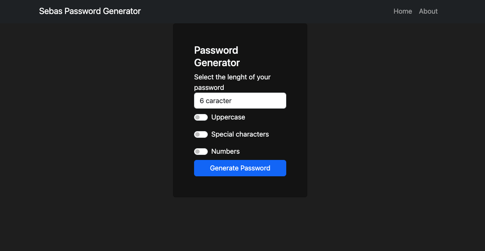

# Generador de Contraseñas Seguras con Python Django y Bootstrap

¡Bienvenido a nuestro repositorio del Generador de Contraseñas Seguras! Esta aplicación web te permite generar contraseñas fuertes y aleatorias con características personalizables para mejorar la seguridad de tus cuentas.

## Características

- **Personalización:** Elige la longitud deseada para la contraseña que deseas generar.
- **Mayúsculas y Minúsculas:** Incluye letras mayúsculas para una seguridad adicional.
- **Caracteres Especiales:** Agrega caracteres especiales para hacer tus contraseñas aún más seguras.

## Tecnología Utilizada

Este generador de contraseñas ha sido construido utilizando las siguientes tecnologías:

- **Python Django:** El framework de aplicación web que potencia el backend.
- **Bootstrap:** Un framework de diseño adaptable que garantiza una interfaz elegante y fácil de usar.

## Cómo Usar

### 1. Instalación de Python

Para comenzar, asegúrate de tener [Python](https://www.python.org/downloads/) instalado en tu sistema. Puedes verificar si ya tienes Python instalado abriendo una terminal y escribiendo:

```sh
python --version
Si ves una versión de Python, ¡estás listo para continuar! Si no, descarga e instala Python desde el enlace proporcionado.

2. Instalación de Django
Antes de continuar, asegúrate de tener pip instalado. pip es el gestor de paquetes de Python que necesitas para instalar Django. En la misma terminal, escribe:

sh
Copy code
pip --version
Si pip está presente, estás listo para instalar Django. Si no, puedes instalarlo aquí.

Ahora, instala Django utilizando el siguiente comando:

sh
Copy code
pip install Django
3. Ejecución de la Aplicación
Clona o descarga este repositorio en tu computadora.

Abre una terminal y navega al directorio del repositorio.

Ejecuta el servidor de desarrollo de Django con el siguiente comando:

sh
Copy code
python manage.py runserver
Abre tu navegador web y ve a http://127.0.0.1:8000 para acceder a la aplicación.


